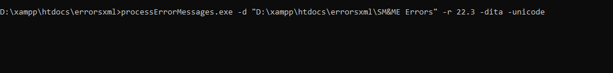
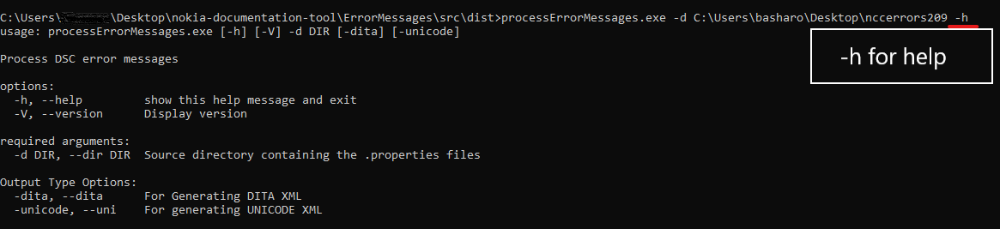
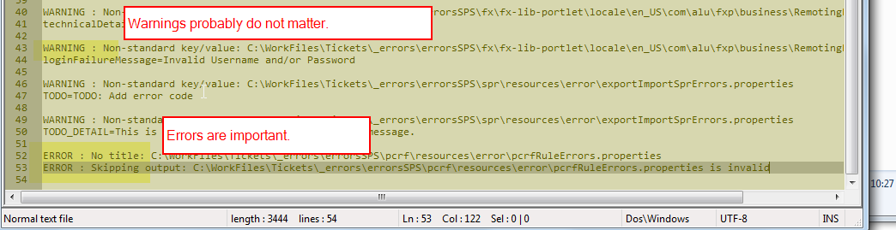

# Processing DSC error messages

Updated: 2022.02.07

The DSC R&D group provides .properties files that contain information about DSC error 
messages and HTTP codes . These files can be individually or collectively processed and converted to .sgml or .xml.

## Prerequisites

- you have the current version of executable unzipped somewhere on your hard drive
- you have the error message .properties files obtained from R&D or by executing Linux/windows command 
- you have the HTTP error codes (.properties file containing error codes ) in same directory with .properties files 

## Procedure

1. Open a command tool.

2. Drag processErrorMessages.exe onto the command tool.

3. Enter, " -d " (space character, -d, space character, and without the quotes)

4. Drag the folder containing the properties files onto the command tool.

5. Enter " -dita " or " -unicode " or both (space character, and without the quotes) to determine output files type

6. Enter " -r " or " --release "  (space character, and without the quotes) and then the release number.

7. after adding all arguments and flags  press the Enter key.

   

## For Help
   
  
  A new directory, "_output", will be created in the source directory. This directory contains 
  subdirectories for the debug and XML files.
 

## Debug messages

The source files are not completely consistent in their markup. Some files may be missing a title or description. 
Some files may have a continuation marker (a '\\' at the end of a line), but do not actually have additional content.

Be sure to check the debug directory for error messages. 

__NOTE:__ Depending on the error, some output messages may be dropped. It is important 

 
  32 

## Problems or issues

If you have any problems, please submit a CDOC ticket.

## History

### Version 1.2, 2022.02.07
- Refactor Tool to be compatible with Python3.
- Fixed some bugs in processing files .
- Add HTTP code column to the generated XML files. 
- Generate Dita XML files.
- Add Flags to determine the type of generated files UNICODE or DITA or both.

### Version 1.1, 2017.03.30
- exclude lines beginning with "#### Note"

### Version 1, 2017.03.21
 - created
 - creates one .xml output file (unidoc dtd)
 - tables occur alphabetically by category title